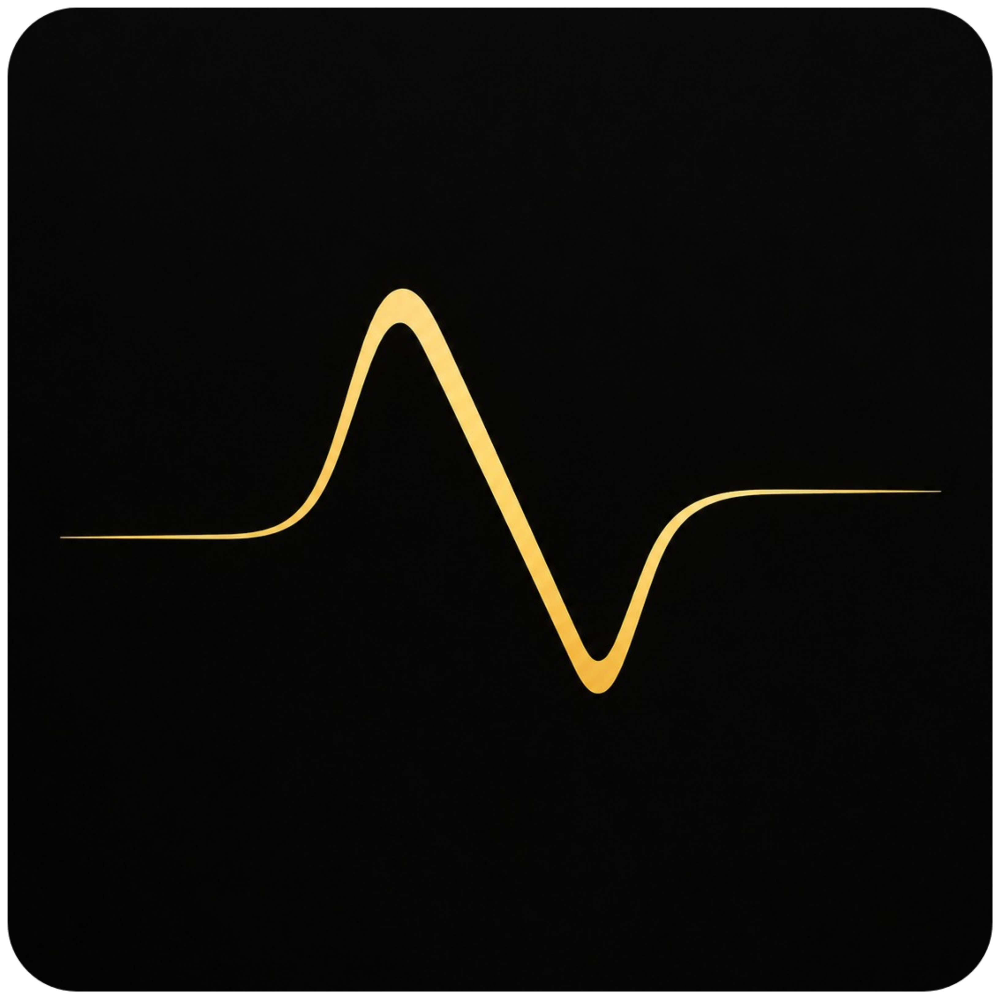

### My Projects

<ul>
  <li>
    <a href="https://github.com/Nazim-Rh/N-Light">
      
      <h4>N-Light</h4>
    </a>
    
An interactive GUI that wraps AstroSat LAXPC (Format-B) data reduction and light curve inspection drives laxpcsoft and HEASoft's <code>lcurve</code> to produce a combined lightcurve plus per-GTI plots, along with an interactive window to inspect the lightcurve and slice its features. Built with Python (PyQt5).

     
  </li>
  <li>
    <a href="https://github.com/Nazim-Rh/Verdict">
      
      <h4>Verdict</h4>
    </a>
    
A desktop app for quickly classifying astronomical detections as real, fake, or uncertain by eye, from FITS cutouts centred on each source with adaptive scaling. Built with Python.

     
  </li>
  <li>
    <a href="https://github.com/Nazim-Rh/Najma">
      
      <h4>Najma</h4>
    </a>
    
A desktop pipeline for source detection, and measuring star formation rates and stellar population ages from Poisson data such as UV/X-ray imaging, along with optional tools for image alignment, combining, cropping, extinction calculation, etc. Built with Python.

     
  </li>
</ul>
